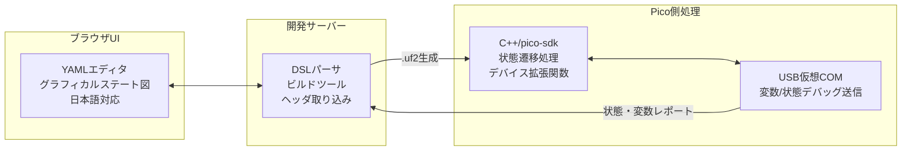

# PicoRin 要件定義書

## 目的

PicoRinは、Raspberry Pi Pico 向けに状態ベース制御を簡潔かつ直感的に設計・デバッグできるプラットフォームです。GUIベースでYAMLを構築し、C++コードに変換してPico上で実行可能にします。

---

## システム全体構成（Mermaid）



---

## YAML DSL仕様

### ステート構文

```yaml
cycle: 10ms

states:
  - name: idle
    when: booted
    do: led_off()

  - name: running
    when: up(start_btn) and safe
    do: motor_on()

  - name: emergency
    when: not safe
    kind: force
    do: motor_off()
```

- `kind: force`：常時評価される特殊ステート
- `do`はユーザー記述のYAML関数呼び出し（ユーザーはC++を書かない）

---

## 変数と信号定義

```yaml
vars:
  safe: input_pin[1]
  start_btn: input_pin[2]
  motor: output_pin[0]
```

- GPIOとの対応や型の推論はツール側で自動処理

---

## 実行構成（Raspberry Pi Pico）

- **2コア利用**
  - Core0：状態遷移・論理演算・制御出力
  - Core1：USB仮想COM通信（デバッグ用）
- 各周期終了時にロック付きで状態・変数をコピー共有
- UI→Picoへの強制変数変更も周期的に反映

---

## 拡張性（Picoデバイス用関数・変数）

- `device.yaml`や`.hpp`ファイルをUIに読み込ませることで、
  - `motor_on()`, `sensor_value`, `reset_counter()`などの関数・変数が`do`, `when`内で使用可能
- ユーザー定義のDSL拡張を柔軟に対応

---

## デバッグ

- USB仮想COMでバイナリデータ送信（高速・小型）
- 変数・ステートの値をUIでリアルタイム表示
- UIからの信号変更（テスト用）も別エリアで管理し、安全に反映
- ログレベルによる警告（例：`next`指定なし時の評価範囲警告）

---

## ローカル開発環境

- **FastAPI + TypeScript/React**
- ファイル構成例：
  - `editor.yaml`: ユーザーが編集するDSL本体
  - `device_defs/device_name.hpp`: Pico固有の関数定義
  - `build/main.cpp`: 自動生成コード（非編集）
- CLI or ブラウザから `.uf2` ファイル出力しPicoに書き込み

---

## 日本語対応

- エラーメッセージ、UI、ログ出力、ヘルプドキュメントすべて日本語表示
- YAML記述時の警告も日本語対応でフィードバック

---

## 将来拡張

- ステートチャート構文によるサブステート表現
- Pico W対応（無線デバッグ）
- マルチマシン協調制御向けDSLの拡張
